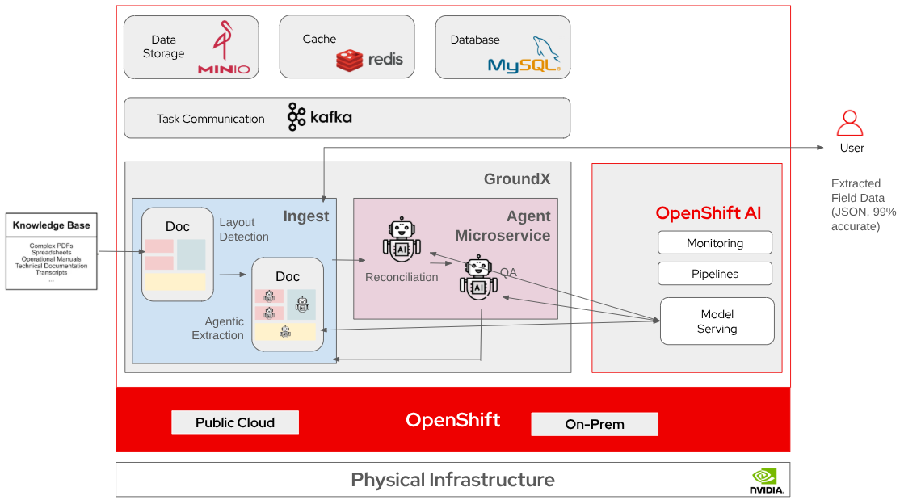

# Data extraction with GroundX with OpenShift AI

GroundX, from EyeLevel, is an enterprise platform that eliminates LLM hallucinations by grounding AI responses in a company’s specific, private data. The platform utilizes advanced computer vision to preserve the context of complex document layouts, such as nested tables and schematics, ensuring high-fidelity search and retrieval. Beyond information discovery, it functions as a powerful tool for automated data extraction, transforming unstructured files into structured, verifiable insights with direct source citations.

When used with OpenShift AI on premises, customers can have complete control of their own data and where it is stored and processed.

## Table of contents

- [Detailed description](#detailed-description)
  - [See it in action](#see-it-in-action)
  - [Architecture diagrams](#architecture-diagrams)
- [Requirements](#requirements)
  - [Minimum hardware requirements](#minimum-hardware-requirements)
  - [Minimum software requirements](#minimum-software-requirements)
  - [Required user permissions](#required-user-permissions)
- [Deploy](#deploy)
  - [Pre-requisites](#pre-requisites)
  - [Deployment steps](#deployment-steps)
- [Demo GroundX](#demo-groundx)
  - [Create storage bucket for models](#create-storage-bucket-for-models)
  - [Create a new workbench in OpenShift AI](#create-a-new-workbench-in-openShift-ai)
  - [Clone this repo](#clone-this-repo)
  - [Copy the model to local storage](#copy-the-model-to-local-storage)
  - [Create the model registry](#create-the-model-registry)
  - [Add the model to the registry](#add-the-model-to-the-registry)
  - [Deploy the model](#deploy-the-model)
- [Delete](#delete)
- [Demo GroundX](#demo-groundx)
- [References](#references)
- [Technical details](#technical-details)
- [Tags](#tags)

## Detailed description

This AI quickstart demonstrates how to use **GroundX** from **EyeLevel** for billing data extraction in an on-prem AI environment with OpenShift AI.

You will deploy GroundX, as well as other components including MinIO (object storage), Percona MySQL, and Strimzi Kafka. You'll then open the included Jupyter notebook and follow the workflow. 

### See it in action

1. Create a new project called `eyelevel` and deploy the following in the project:
  - Custom storage class
  - Percona Server for MySQL
  - MinIO
  - Kafka
  - GroundX
2. Run a Jupytper notebook to demostrate data extraction from a mobile phone bill

### Architecture diagrams




## Requirements

This quickstart was developed and tested on an OpenShift cluster with the following components and resources. This can be considered the minimum requirements.

### Minimum hardware requirements 

| Node Type           | Qty  | vCPU   | Memory (GB) |
| --------------------|------|-------|--------------|
| Control Plane       | 3    | 4     | 16           |
| Worker              | 3    | 4     | 16           |

Nvidia GPU with 16GB of vRAM

### Minimum software requirements

This quickstart was tested with the following software versions:

| Software                           | Version  |
| ---------------------------------- |:---------|
| Red Hat OpenShift                  | 4.20.5   |
| Red Hat OpenShift Service Mesh     | 2.5.11-0 |
| Red Hat OpenShift Serverless       | 1.37.0   |
| Red Hat OpenShift AI               | 2.25     |
| helm                               | 3.17.1   |
| GroundX                            | 2.9.92   |
| MinIO                              | TBD      |
| Strimzi Kafka                      | TBD      |
| Percona MySQL                      | TBD      |


### Required user permissions

The user performing this quickstart should have the ability to create a project in OpenShift and OpenShift AI. This requires the cluster role of `admin` (does not require `cluster-admin`)


## Deploy

The process is very simple. Just follow the steps below.

### Pre-requisites

The steps assume the following pre-requisite products and components are deployed and functional with required permissions on the cluster:

1. Red Hat OpenShift Container Platform
2. Red Hat OpenShift Service Mesh
3. Red Hat OpenShift Serverless
4. Red Hat OpenShift AI
5. Red Hat Authorino
6. Node Feature Discovery operator
7. Nvidia GPU operator
8. User has `admin` permissions in the cluster
9. The `eyelevel` project should not exist

### Deployment Steps

1. Clone this repo and change into the directory
```
$ git clone https://github.com/rh-ai-quickstart/Billing-extraction-with-GroundX.git

$ cd Billing-extraction-with-GroundX
```

Set the API key in `values.groundx.secret.yaml`
```
$ cp <secret_with_key>.yaml Billing-extraction-with-GroundX/values/values.groundx.secret.yaml
```

2. Login to the OpenShift cluster:
```
$ oc login --token=<user_token> --server=https://api.<openshift_cluster_fqdn>:6443
```

3. Make sure `setup` file is executable and run it, passing it the name of the project in which to install. Deploy to the `eyelevel` project.
```
# Make script executable
$ chmod + setup

# Run script passing it the project in which to install
$ ./setup eyelevel
```

## Demo GroundX
The following steps walk through the demonstration.

### Create storage bucket for models
The model used for the demonstration will be copied from Hugging Face to the local Minio instance. For this, we'll create a `models` storage bucket.
1. Use the Minio console route to access Minio's UI
2. Create a storge bucket called `models`

### Create a new workbench in OpenShift AI
In OpenShift AI, create a workbench, following the steps below. You'll need your Hugging Face token to add to the environment variable.

1. In OpenShift AI, enter into the `eyelevel` project
2. Create a workbench
   - **Name**: groundx-wb
   - **Image selection**: Jupyter | Minimal | CPU | Python 3.12
   - **Version selection**: 2025.2
   - **Container size**: Small
   - **Accelerator**: None
   - Add an environment variable
     - **Type**: Secret --> Key / value
     - **Key**: HF_TOKEN
     - **Value**: YOUR_HUGGING_FACE_TOKEN
   - Click on **Create connection** button
     - Select **S3 compatible object storage**
    -  **Connection name**: Models-Storage
    -  **Access key**: minio
    -  **Secret key**: minio123
    -  **Endpoint** http://minio
    -  **Region**: us-east-1
    -  **Bucket**: models
3. Click **Create notebook**

### Clone this repo
1. Open the running workbench
2. Clone this repo into the workbench

### Copy the model to local storage
1. Open the **Transfer_models** notebook
2. Set the `s3_path` to `RedHatAI/gemma-3-12b-it-quantized.w4a16`
3. Save and run the notebook

### Create the model registry
1. From the OpenShift console's **Software Catalog**, search for the **MySQL** template
2. Create an instance of **MySQL** using the template
3. In the OpenShift AI dashboard, as an admin user, go to **Model Registry Settings**
4. Create a new model registry using the newly deployed MySQL server

### Add the model to the registry
1. In the OpenShift AI dashboard, go to **Models**, the to **Model Registries**
2. Select the model registry just created
3. Click to register a new model
4. Fill out the form with the information about the model stored in the `models` storage bucket in Minio

### Deploy the model
1. Enter into the `eyelevel` project
2. On the **Models** tab, make sure a **Single Model Server** is running
3. Deploy the model from the regsitry

### Run the GroundX demo
1. Open the **get_started** notebook
2. Set the `s3_path` to RedHatAI/gemma-3
3. Save and run the notebook

### Delete

Run the `uninstall` script to delete the application and project.
```
# Make script executable
$ chmod + uninstall

# Run script passing it the project in which to uninstall
$ ./uninstall eyelevel
```

## References 

* [GroundX documentation](https://docs.eyelevel.ai/documentation/fundamentals/welcome)
* OpenShift AI documentatin [v2.25](https://docs.redhat.com/en/documentation/red_hat_openshift_ai_self-managed/2.25)

## Technical details


## Tags

* Product: OpenShift AI
* Partner: EyeLevel
* Partner product: GroundX
* Business challenge: Data extraction
