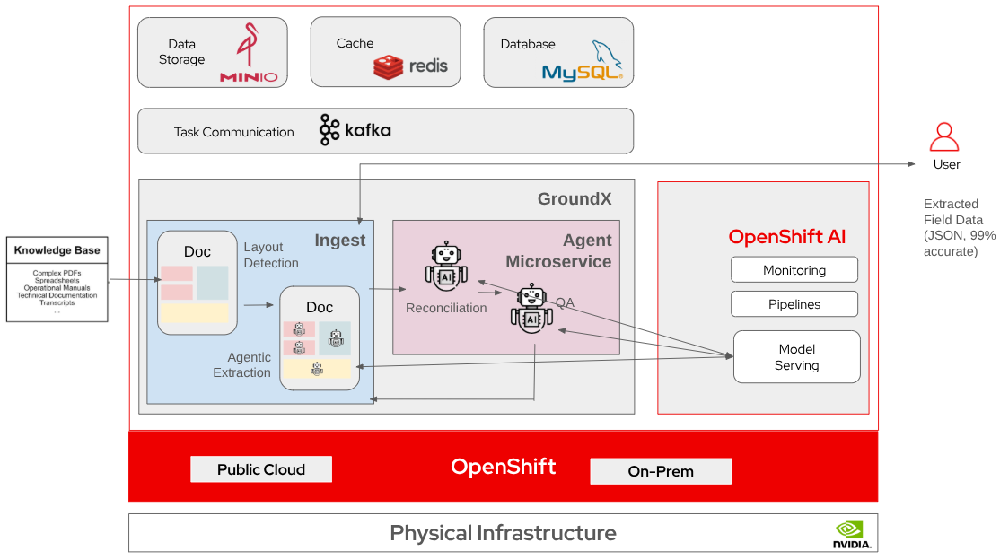

# Extract billing data with GroundX on OpenShift AI

Learn how to extract structured billing data from unstructured documents using GroundX&reg; on Red Hat OpenShift AI&reg; with complete data control on-premises.

## Table of contents

- [Detailed Description](#detailed-description)
  - [See It in Action](#see-it-in-action)
  - [Architecture Diagram](#architecture-diagram)
- [Requirements](#requirements)
  - [Minimum Hardware Requirements](#minimum-hardware-requirements)
  - [Minimum Software Requirements](#minimum-software-requirements)
  - [Required User Permissions](#required-user-permissions)
- [Deploy](#deploy)
  - [Pre-requisites](#pre-requisites)
  - [Installation](#installation)
  - [Verify the Deployment](#verify-the-deployment)
- [Demo GroundX](#demo-groundx)
  - [Create Storage Bucket for Models](#create-storage-bucket-for-models)
  - [Use the Chart-managed Notebook (Recommended)](#use-the-chart-managed-notebook-recommended)
  - [Create a New Workbench Manually](#create-a-new-workbench-manually)
  - [Run the GroundX Demo](#run-the-groundx-demo)
- [Uninstall](#uninstall)
- [References](#references)
- [Technical Details](#technical-details)
- [Tags](#tags)

## Overview

This AI quickstart demonstrates how to use **GroundX** from **EyeLevel** for billing data extraction in an on-prem AI environment with OpenShift AI. You will deploy GroundX along with its supporting components (MinIO, Percona MySQL, and Strimzi Kafka) using two umbrella Helm charts, then open the included Jupyter notebook and follow the data extraction workflow.

GroundX, from EyeLevel, is an enterprise platform that eliminates LLM hallucinations by grounding AI responses in a company's specific, private data. The platform utilizes advanced computer vision to preserve the context of complex document layouts, such as nested tables and schematics, ensuring high-fidelity search and retrieval. Beyond information discovery, it functions as a powerful tool for automated data extraction, transforming unstructured files into structured, verifiable insights with direct source citations. When used with OpenShift AI on premises, customers can have complete control of their own data and where it is stored and processed.

### See it in action

<!-- Future: Add link to recorded demo or arcade -->

### Architecture



## Requirements

This quickstart was developed and tested on a Red Hat OpenShift&reg; cluster with the following components and resources. This can be considered the minimum requirements.

### Minimum hardware requirements

| Node Type     | Qty | vCPU | Memory (GB) |
|---------------|-----|------|-------------|
| Control Plane | 3   | 4    | 16          |
| Worker        | 3   | 4    | 16          |

GPU with 24 GB of vRAM (optional — see [GPU configuration](#gpu-configuration-for-layout-inference)).

### Minimum software requirements

| Software                       | Version  |
|--------------------------------|----------|
| Red Hat OpenShift              | 4.20.5   |
| Red Hat OpenShift Service Mesh | 2.5.11-0 |
| Red Hat OpenShift Serverless   | 1.37.0   |
| Red Hat OpenShift AI           | 2.25     |
| Helm CLI                       | 3.17.1   |
| GroundX                        | 2.9.92   |

### Required user permissions

The user performing this quickstart should have `admin` permissions in the cluster (does not require `cluster-admin`).

## Deploy

Deployment uses two Helm umbrella charts installed in sequence:

| Chart | Path | Purpose |
|-------|------|---------|
| **billing-operators** | `helm/billing-operators/` | Operators and cluster prep (storage class, node labels, Percona operator, MinIO operator, optional Strimzi operator) |
| **billing-workloads** | `helm/billing-workloads/` | Application workloads (database cluster, MinIO tenant, Kafka cluster, GroundX, Jupyter notebook) |

### Pre-requisites

The following must already be deployed and functional on the cluster:

1. Container Platform
2. OpenShift Service Mesh
3. OpenShift Serverless
4. OpenShift AI
5. Authorino
6. Node Feature Discovery operator
7. NVIDIA GPU operator (if using GPU for layout inference)
8. User has `admin` permissions in the cluster
9. The `eyelevel` project should not exist

### Installation

1. **Clone this repo and log in to your cluster:**

```bash
git clone https://github.com/rh-ai-quickstart/Billing-extraction-with-GroundX.git
cd Billing-extraction-with-GroundX

oc login --token=<user_token> --server=https://api.<openshift_cluster_fqdn>:6443
```

2. **Set the GroundX Agent API key** as an environment variable:

With the current values.yaml configuration this API key is expected to be OPENAI_API_KEY since we by default are using Open AI LLMs for inference.

```bash
export GROUNDX_AGENT_API_KEY="<your-groundx-agent-api-key>"
```

This key is required and is used to populate the `GROUNDX_AGENT_API_KEY` field in the `eyelevel-secret-credentials` Kubernetes Secret (managed by the `groundx-secret` subchart). The Makefile will fail with an error if the variable is not set.

3. **Review and edit the values files** to match your environment:
   - `helm/billing-operators/values.yaml` — operator toggles, node labels
   - `helm/billing-workloads/values.yaml` — GroundX config, notebook settings, resource limits

4. **Install using the Makefile** (recommended):

**Be sure to set GROUNDX_AGENT_API_KEY env variable.**

```bash
# From the repo root — installs operators first, then workloads
make install
```

Or install each chart manually:

```bash
# Create the namespace
oc create namespace eyelevel --dry-run=client -o yaml | oc apply -f -

# Update chart dependencies
cd helm/billing-operators && helm dependency update && cd ../..
cd helm/billing-workloads && helm dependency update && cd ../..

# Phase 1: Operators
helm upgrade --install billing-operators ./helm/billing-operators \
  -f ./helm/billing-operators/values.yaml -n eyelevel

# Phase 2: Workloads
helm upgrade --install billing-workloads ./helm/billing-workloads \
  -f ./helm/billing-workloads/values.yaml -n eyelevel \
  --set groundx-secret.data.GROUNDX_AGENT_API_KEY="${GROUNDX_AGENT_API_KEY}"
```

### Verify the deployment

```bash
make get-pods
# or
oc get pods -n eyelevel
```

All pods should reach `Running` (or `Completed` for one-shot Jobs).

### GPU configuration for layout inference

To disable GPU for GroundX layout inference, add the following to `helm/billing-workloads/values.yaml` under `groundx.layout.inference`:

```yaml
layout:
  inference:
    resources:
      limits:
        memory: 12Gi
        nvidia.com/gpu: '0' # <-- Set to 0
      requests:
        cpu: 500m
        memory: 2Gi
        nvidia.com/gpu: '0' # <-- Set to 0
```

To run with a GPU, set `nvidia.com/gpu` to `'1'`. See the comments in `values/values.groundx.yaml` for details.

### Uninstall

```bash
# From the repo root
make uninstall
```

Or manually:

```bash
cd helm && make uninstall NAMESPACE=eyelevel
```

This uninstalls the workloads chart first (clearing CRs and finalizers), then the operators chart. The namespace is preserved by default — delete it separately with `oc delete project eyelevel` if desired.

## Demo GroundX

### Create a storage bucket for models

1. Use the MinIO console route to access MinIO's UI.
2. Create a storage bucket called `models`.

### Use the chart-managed Notebook (recommended)

The billing-workloads chart creates an OpenShift AI **Notebook** and, by default, a Helm **post-install / post-upgrade Job** (`helm/billing-workloads/templates/notebook/git-clone-job.yaml`) that waits for the notebook pod to be Ready, then clones the quickstart repository into the notebook PVC under `notebook.gitClone.targetDir`.

1. Configure notebook settings in `helm/billing-workloads/values.yaml`.
2. Git clone is **enabled by default** (`notebook.gitClone.enabled: true`). To turn it off (for example, air-gapped clusters), set `notebook.gitClone.enabled: false` and clone the repo manually inside the workbench.
3. Override clone source or branch as needed:
   - `notebook.gitClone.repository` (default: `https://github.com/rh-ai-quickstart/Billing-extraction-with-GroundX.git`)
   - (optional) `notebook.gitClone.revision`, `notebook.gitClone.targetDir`, `notebook.gitClone.forceReset`, `notebook.gitClone.cloneRetries`
4. Deploy/upgrade the chart:

```bash
make install
```

5. Open the created notebook from **OpenShift AI → Workbenches**.

### Create a new workbench manually

If you are not using the chart-managed notebook, create a workbench in OpenShift AI:

1. In OpenShift AI, enter the `eyelevel` project.
2. Create a workbench:
   - **Name**: `groundx-wb`
   - **Image selection**: Jupyter | Minimal | CPU | Python 3.12
   - **Version selection**: 2025.2
   - **Container size**: Small
   - **Accelerator**: None
   - Add environment variables IMPORTANT READ:
     - **Type**: Secret → Key / value
       - **Key**: `GROUNDX_ADMIN_API_KEY` — **Value**: `<YOUR_GROUNDX_ADMIN_API_KEY>`
     - **Type**: ConfigMap → Key / value
       - **Key**: `GROUNDX_BASE_URL` — **Value**: `<GROUNDX_OPENSHIFT_ROUTE>/api`: IMPORTANT: This is set in the `values.yaml` file and needs to have /api appended.

   - Click **Create connection**:
     - Select **S3 compatible object storage**
     - **Connection name**: `Models-Storage`
     - **Access key**: `minio`
     - **Secret key**: `minio123`
     - **Endpoint**: `http://minio`
     - **Region**: `us-east-1`
     - **Bucket**: `models`
3. Click **Create notebook**.
4. Clone this repo into the workbench if you disabled the chart git-clone Job (`notebook.gitClone.enabled: false`).

### Run the GroundX demo

1. Open the **get_started** notebook.
2. In the `Initialize Client and Prompt Manager` section, set the required variables (OpenShift route to GroundX, API key).
3. Save and run the notebook.

## References

- [GroundX documentation](https://docs.eyelevel.ai/documentation/fundamentals/welcome)
- OpenShift AI documentation [v2.25](https://docs.redhat.com/en/documentation/red_hat_openshift_ai_self-managed/2.25)

## Technical details

### Deploying Gemma 3 12B via LLM service (optional)

The chart can deploy **google/gemma-3-12b-it** using the [llm-service](https://github.com/rh-ai-quickstart/ai-architecture-charts/tree/main/llm-service) from the ai-architecture-charts repo.

- **Enable**: In `helm/billing-workloads/values.yaml`, `llm-service.enabled` is `true` by default and `global.models.gemma-3-12b-it` is configured.
- **Requirements**: Nodes with NVIDIA GPUs (`nvidia.com/gpu`); the model uses the default GPU device and tolerations from the llm-service chart.
- **Hugging Face token**: If the model is gated, set `llm-service.secret.hf_token` (e.g. via a values override or sealed secret).
- **Use with GroundX**: After deploy, the model is exposed as a KServe InferenceService. To use it for GroundX extract, set the extract agent to your cluster's endpoint for the `gemma-3-12b-it` predictor (e.g. the OpenShift route or `http://gemma-3-12b-it-predictor.<namespace>.svc.cluster.local/v1`), and set `modelId` to the served model name.

To disable the LLM service, set `llm-service.enabled: false` in values.

## Tags

- **Industry:** Financial Services
- **Product:** OpenShift AI
- **Partner:** EyeLevel
- **Partner product:** GroundX
- **Business challenge:** Data extraction
