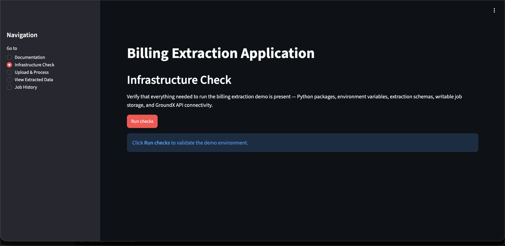

# Accelerate financial and billing data extraction

<!-- TITLE: Accelerate financial and billing data extraction -->

Extract structured financial and billing data from unstructured documents, such as PDFs or images, using GroundX&reg.

<!-- SHORT DESCRIPTION: Extract structured financial and billing data from unstructured documents, such as PDFs or images, using GroundX. -->

## Table of contents

- [Detailed description](#detailed-description)
  - [See it in action](#see-it-in-action)
  - [Architecture diagrams](#architecture-diagrams)
- [Requirements](#requirements)
  - [Minimum hardware requirements](#minimum-hardware-requirements)
  - [Minimum software requirements](#minimum-software-requirements)
  - [Required user permissions](#required-user-permissions)
- [Deploy](#deploy)
  - [Prerequisites](#prerequisites)
  - [Installation](#installation)
  - [Monitor deployment](#monitor-deployment)
  - [Demo billing extraction](#demo-billing-extraction)
  - [Delete](#delete)
- [References](#references)
- [Technical details](#technical-details)
  - [GPU configuration for GroundX inference](#gpu-configuration-for-groundx-inference)
- [Tags](#tags)

## Detailed description

For many organizations, critical financial and billing information remains locked inside unstructured formats like scans, PDFs, and images. Extracting this data traditionally requires slow, error-prone manual entry or brittle, template-based OCR systems that break whenever a vendor shifts a column or alters a layout. Processing complex document structures—such as nested tables, multi-page invoices, and diverse document formats—at scale remains a highly complex technical challenge.

This AI quickstart is designed to bypass those hurdles, helping you get up and running quickly with a robust, production-ready extraction pipeline. You will deploy GroundX from EyeLevel to automate billing data extraction within a secure, on-premises AI environment powered by OpenShift AI.

### See it in action

See a detailed walkthrough of the UI-based quickstart application:
[Walkthrough](./apps/ui/DETAIL_WALKTHROUGH.md)

### Architecture diagrams


## Requirements

This quickstart was developed and tested on a Red Hat OpenShift&reg; cluster with the following components and resources. These can be considered the minimum requirements.

### Minimum hardware requirements

| Node Type     | Qty | vCPU | Memory (GB) |
|---------------|-----|------|-------------|
| Control Plane | 3   | 4    | 16          |
| Worker        | 3   | 4    | 16          |

### Minimum software requirements

This quickstart was tested with the following software versions:

| Software                           | Version  |
| ---------------------------------- |:---------|
| Red Hat OpenShift                  | 4.20.5   |
| Red Hat OpenShift Service Mesh     | 2.5.11-0 |
| Red Hat OpenShift Serverless       | 1.37.0   |
| Red Hat OpenShift AI               | 3.4      |
| helm                               | 3.17.1   |
| GroundX                            | 2.9.92   |

### Required user permissions

The user performing this quickstart should be able to create a project and install both Helm charts. Roles differ by chart:

| Chart | Required role | Purpose |
|-------|---------------|---------|
| `billing-operators` | **cluster-admin** (or equivalent) | Installs operators, storage class, node labels, and SCCs |
| `billing-workloads` | **admin** (namespace-level) | Deploys GroundX, MinIO tenant, database, UI, and notebook into `eyelevel` |

> [!NOTE]
> A single `make -C helm install` runs both charts. Use an account that can install `billing-operators` (typically `cluster-admin`). If operators are already installed cluster-wide, an admin can install only the workloads chart.

## Deploy

Deployment uses two Helm umbrella charts, installed in sequence through a Makefile:

| Chart | Path | Purpose |
|-------|------|---------|
| **billing-operators** | `helm/billing-operators/` | Operators and cluster prep (storage class, node labels, Percona operator, MinIO operator, optional Strimzi operator) |
| **billing-workloads** | `helm/billing-workloads/` | Application workloads (database cluster, MinIO tenant, Kafka cluster, GroundX, Streamlit UI, Jupyter notebook) |

By default, GroundX layout and ranker inference run on **CPU**. Optional GPU settings are documented under [Technical details](#gpu-configuration-for-groundx-inference).

### Prerequisites

The steps assume the following products and tools are already available on the cluster:

1. Red Hat OpenShift Container Platform
2. Red Hat OpenShift Service Mesh
3. Red Hat OpenShift Serverless
4. Red Hat OpenShift AI
5. Authorino (typically installed with OpenShift AI / Service Mesh)
6. Helm 3.x installed locally
7. `oc` CLI installed and authenticated
8. The `eyelevel` project/namespace does not already exist

> [!NOTE]
> **GPU is optional.** Default GroundX inference uses CPU. Install the Node Feature Discovery and NVIDIA GPU operators only if you enable GPU inference (see [Technical details](#gpu-configuration-for-groundx-inference)).

### Installation

1. **Clone this repo and log in to your cluster:**

```bash
git clone https://github.com/rh-ai-quickstart/Billing-extraction-with-GroundX.git
cd Billing-extraction-with-GroundX

oc login --token=<user_token> --server=https://api.<openshift_cluster_fqdn>:6443
```

2. **Create the workloads secret file** (required — credentials are not stored in git):

```bash
cp helm/billing-workloads/secret.example.yaml helm/billing-workloads/secret.yaml
```

Edit `helm/billing-workloads/secret.yaml` and set at least these keys under `groundx-secret.data`:

| Key in `secret.yaml` | What it is | Used by |
|----------------------|------------|---------|
| `GROUNDX_ADMIN_API_KEY` | GroundX platform / admin API key | Streamlit UI (`GROUNDX_API_KEY` in the pods) |
| `GROUNDX_AGENT_API_KEY` | OpenAI-compatible API key (not a placeholder like `sk-CHANGE_ME`) | GroundX layout and extract agents |

> [!IMPORTANT]
> **`GROUNDX_ADMIN_API_KEY` can be any UUID you choose** — it does not come from GroundX or another provider. Pick any value in UUID format (for example `00000000-0000-0000-0000-000000000001`) and use the same value consistently. Do **not** confuse it with `GROUNDX_AGENT_API_KEY`, which must be a real OpenAI-compatible API key.

No shell environment variables are required for install. Helm merges `secret.yaml` into the chart and creates the `eyelevel-secret-credentials` Kubernetes Secret.

> [!NOTE]
> `helm/billing-operators/secret.yaml` is **NOT OPTIONAL**.

`make -C helm install` only checks that `helm/billing-workloads/secret.yaml` **exists**.

3. **Review and edit the values files** to match your environment:
   - `helm/billing-operators/values.yaml` — operator toggles, node labels
   - `helm/billing-workloads/values.yaml` — GroundX config, notebook settings, resource limits

4. **Install using the Makefile** (recommended):

```bash
# From the repo root — installs operators first, then workloads
make -C helm install
```

### Monitor deployment

```bash
oc get pods -n eyelevel
```

All pods should reach `Running` (or `Completed` for one-shot Jobs).

### Demo billing extraction

#### Access the UI

1. Open the frontend UI route in the OpenShift console (**Networking → Routes**), or:

```bash
oc get route -n eyelevel -l app.kubernetes.io/component=frontend \
  -o jsonpath='https://{.items[0].spec.host}{"\n"}'
```

The URL looks like `https://billing-workloads-frontend-eyelevel.<cluster_domain>/`.

2. Follow the [Data Extraction UI walkthrough](./apps/ui/DETAIL_WALKTHROUGH.md) below to run extraction in the app.



| Page | Description |
|------|-------------|
| **Documentation** | What the app is, what GroundX does, and what success looks like |
| **Infrastructure Check** | Validate SDK, credentials, schemas, and GroundX API connectivity |
| **Upload & Process** | Select a sample bill (or upload PDF/JPG/PNG) and run extraction with `simple.yaml` |
| **View Extracted Data** | Inspect the latest JSON and field table; download results |
| **Job History** | Browse past submissions and reopen extracted data |

Typical flow: **Infrastructure Check** → **Upload & Process** (try **AT&T Wireless**) → **View Extracted Data** → **Job History**.

### Delete

Remove the deployment using the Makefile:

```bash
# From the repo root — uninstalls both charts and deletes the eyelevel project
make -C helm uninstall
```

This uninstalls the workloads chart first (clearing CRs and finalizers), then the operators chart, then deletes the `eyelevel` project.

If the project remains, remove it manually:

```bash
oc delete project eyelevel
```

## References

* GroundX documentation [v2.9](https://docs.eyelevel.ai/documentation/fundamentals/welcome)
* Red Hat OpenShift AI documentation [v3.4](https://docs.redhat.com/en/documentation/red_hat_openshift_ai_self-managed/3.4/)
* [Red Hat OpenShift documentation](https://docs.redhat.com/en/documentation/openshift_container_platform)

## Technical details

### GPU configuration for GroundX inference

By default, the billing-workloads chart runs GroundX layout and ranker inference on CPU. There is no separate “suppress GPU” flag — the chart overrides the upstream GroundX defaults (which request a GPU) in `helm/billing-workloads/values.yaml`:

| Setting | Effect |
| --- | --- |
| `deviceType: cpu` | Runs the container on CPU instead of CUDA |
| `nvidia.com/gpu: '0'` | Prevents the scheduler from allocating a GPU |

**Layout inference** (`groundx.layout.inference`):

```yaml
layout:
  inference:
    deviceType: cpu
    resources:
      limits:
        memory: 12Gi
        nvidia.com/gpu: '0'
      requests:
        cpu: 500m
        memory: 2Gi
        nvidia.com/gpu: '0'
```

**Ranker inference** (`groundx.ranker.inference`) — also CPU by default, with fewer workers and more memory than the GPU defaults:

```yaml
ranker:
  inference:
    deviceType: cpu
    workers: 2
    resources:
      limits:
        memory: 8Gi
        nvidia.com/gpu: '0'
      requests:
        cpu: 1500m
        memory: 4Gi
        nvidia.com/gpu: '0'
```

To enable GPU inference, set `nvidia.com/gpu` to `'1'` and `deviceType` to `cuda` (for ranker; layout follows the same pattern). Use a GPU with roughly 24 GB of memory (for example NVIDIA A10, L40S, or A100). See the comments in `helm/billing-workloads/values.yaml` for the full GPU resource blocks. Nodes labeled for GroundX (`gpuLayout` / `gpuRanker`) must have an NVIDIA GPU available, and the NVIDIA GPU operator must be installed.

## Tags

<!--
Title: Accelerate financial and billing data extraction
Description: Extract structured financial and billing data from unstructured documents, such as PDFs or images, using GroundX.
Industry: Banking and securities
Product: OpenShift AI
Use case: Data extraction, Document intelligence
Contributor org: Red Hat
-->

- **Industry:** Banking and securities
- **Product:** OpenShift AI
- **Partner:** EyeLevel
- **Partner product:** GroundX
- **Use case:** Data extraction, Document intelligence
