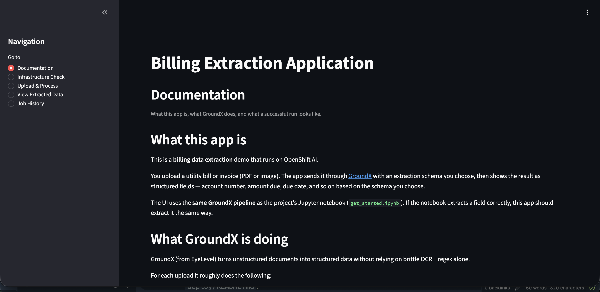
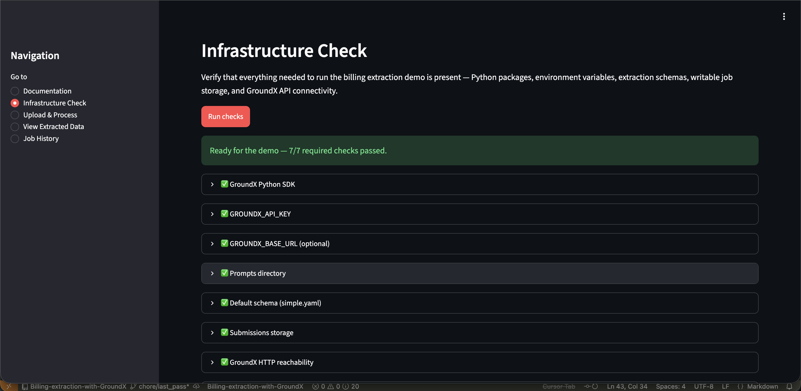
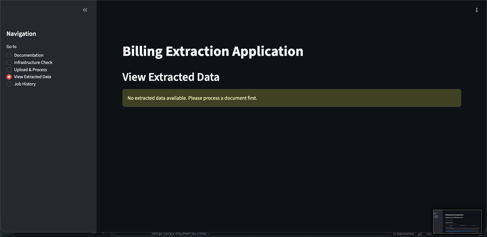
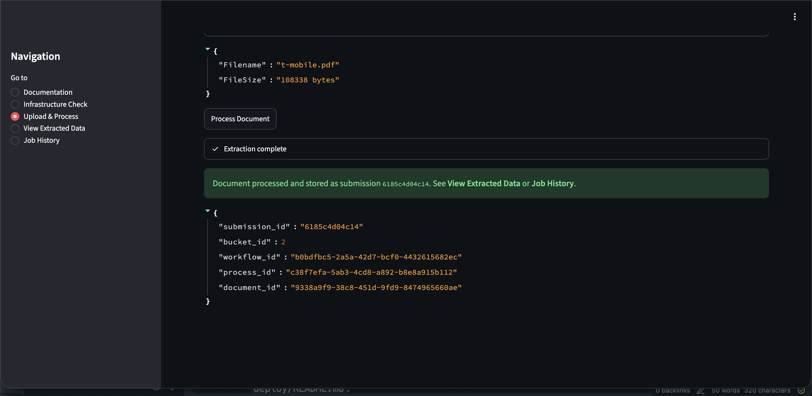
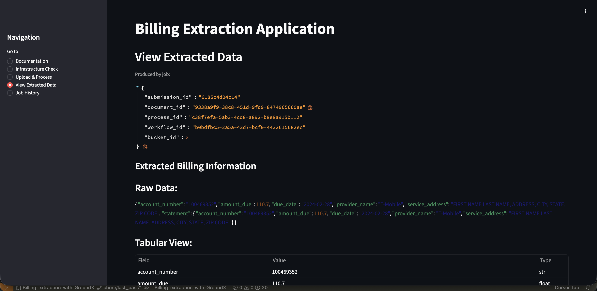
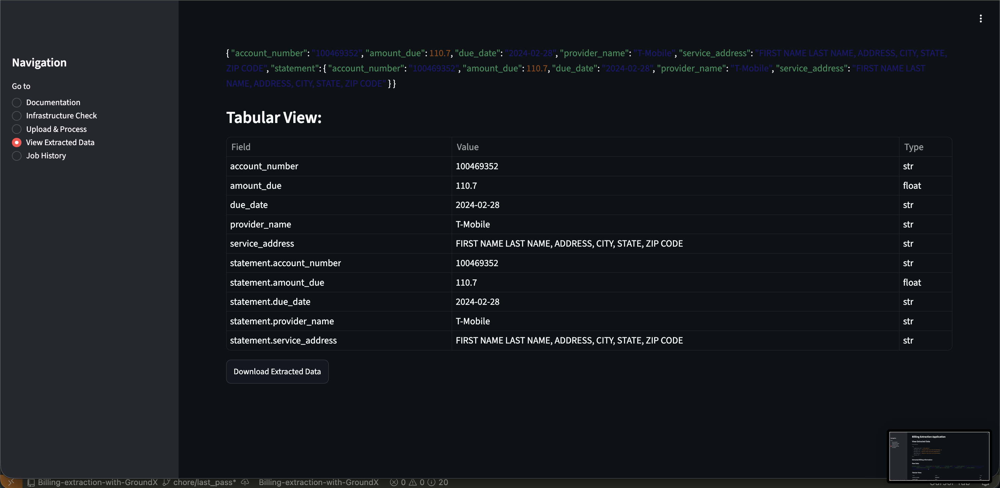
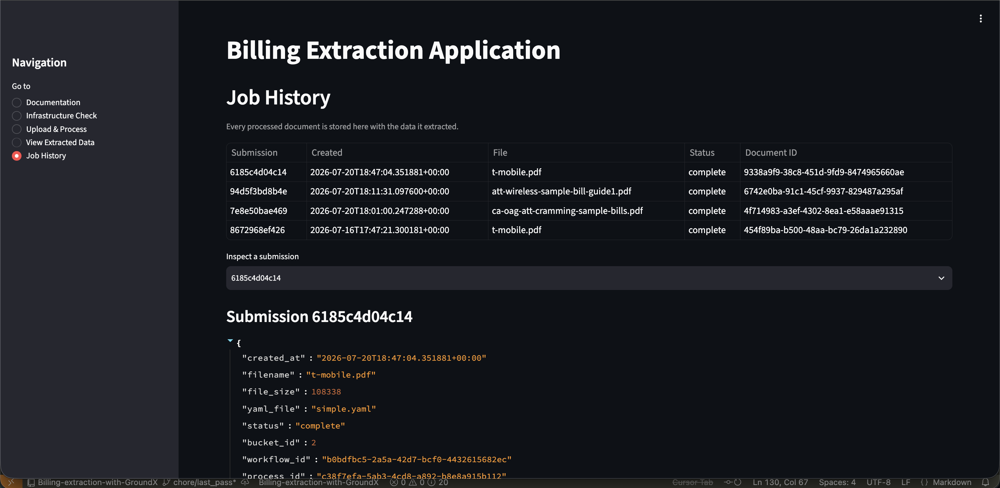

# Billing Extraction UI — walkthrough

This Streamlit app extracts **structured billing fields** from unstructured documents (PDF or image) using **GroundX**. You pick a schema, run a bill through the pipeline, and inspect the resulting JSON.

Use the sidebar to move between pages in this order for a typical demo:

| Page | Purpose |
|------|---------|
| **Documentation** | What the app is and what a successful run looks like |
| **Infrastructure Check** | Confirm the environment can talk to GroundX |
| **Upload & Process** | Select or upload a bill and run extraction |
| **View Extracted Data** | Inspect the latest extract |
| **Job History** | Browse past runs |

---

## Documentation

Orientation only — no GroundX calls. The page looks like this:

It covers:

- What this app is (billing extraction on OpenShift AI with GroundX)
- What GroundX does (layout understanding → schema workflow → ingest → extract)
- What success looks like (populated fields such as account number, amount due, due date)
- What each sidebar page is for

Start here if you are new to the UI, then move to **Infrastructure Check**.

---

## Infrastructure Check

Validates that the demo can run before you upload a document.

Click **Run checks**. The page reports pass/fail for each dependency:

Required and optional checks include:

- GroundX Python SDK
- `GROUNDX_API_KEY`
- `GROUNDX_BASE_URL` (optional on SaaS; expected on OpenShift)
- `prompts/` directory and default schema `simple.yaml`
- Writable submissions storage
- GroundX HTTP reachability (when a base URL is set)
- GroundX API authentication (list buckets)

When everything required passes, you should see a ready banner like this:

Fix any **required** failures before continuing. When checks pass, open **Upload & Process**.

---

## Upload & Process

This page runs a live extraction. You confirm the schema, pick a sample bill or upload your own file, then process:

Steps:

1. Confirm the extraction schema (default **`simple.yaml`**). Expand the schema preview if you want to see the field definitions.
2. Choose a **sample document** (AT&T Wireless, CA OAG AT&T Cramming, or T-Mobile) **or** upload your own PDF / JPG / PNG (max 50 MB).
3. Optionally preview the document.
4. Click **Process Document**.

While processing, the app:

1. Creates or reuses a GroundX bucket
2. Creates a workflow from the selected YAML schema
3. Ingests the document
4. Polls until processing completes
5. Downloads the structured extractions

Status messages appear live while that runs. On success, GroundX job IDs and a submission ID are shown — for example:

Results are then available on **View Extracted Data** and **Job History**.

**Note:** The default schema is tuned for the sample bills. Arbitrary new documents may return incomplete or empty fields if labels and layout do not match the schema.

Fields requested by `simple.yaml`:

| Field | Meaning |
|-------|---------|
| `account_number` | Customer account ID |
| `amount_due` | Total amount owed |
| `due_date` | Payment due date (`YYYY-mm-dd`) |
| `provider_name` | Company owed payment |
| `service_address` | Service / mail-to location |

---

## View Extracted Data

Shows the **latest** extraction from this session:

- Job identifiers for the run that produced the data
- Raw JSON
- Flattened table (Field / Value / Type)
- Download as `extracted_billing_data.json`

There are two ways to inspect the same result.

### JSON view

### Tabular view

If every field is null or blank, ingest finished but extraction did not populate values — treat that as a failed extract, not a successful demo result. Use **Job History** for older runs.

---

## Job History

Lists every processed document stored by the app:

From here you can:

- Browse the summary table (submission ID, time, filename, status, document ID)
- Select a submission to inspect metadata, errors, and extracted JSON
- Download that run’s JSON

Use this page to reopen past results without re-processing.
